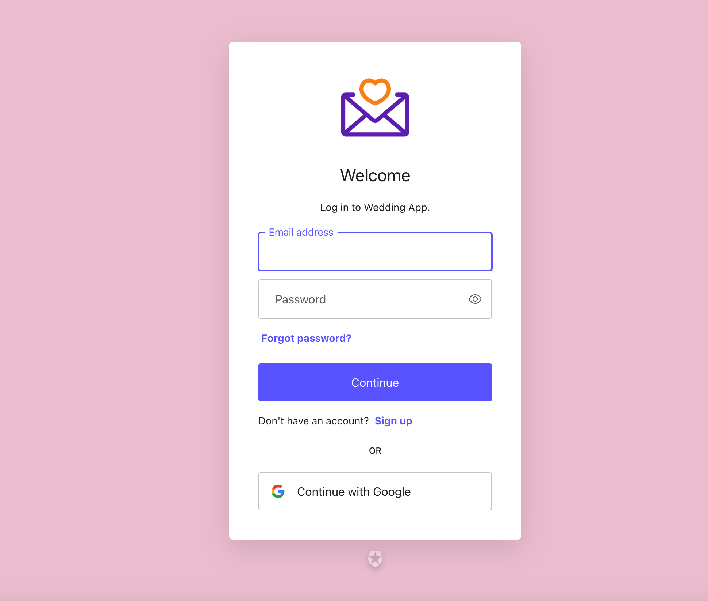
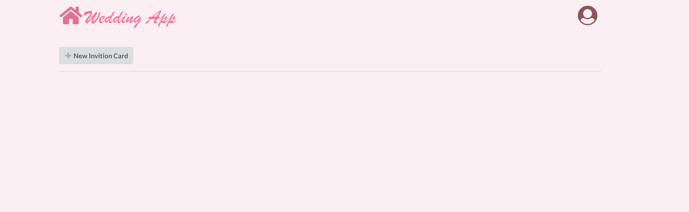
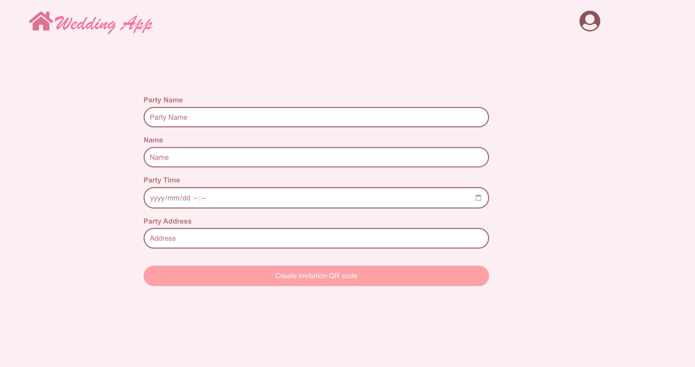
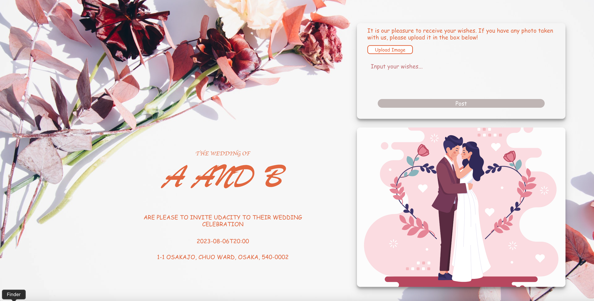
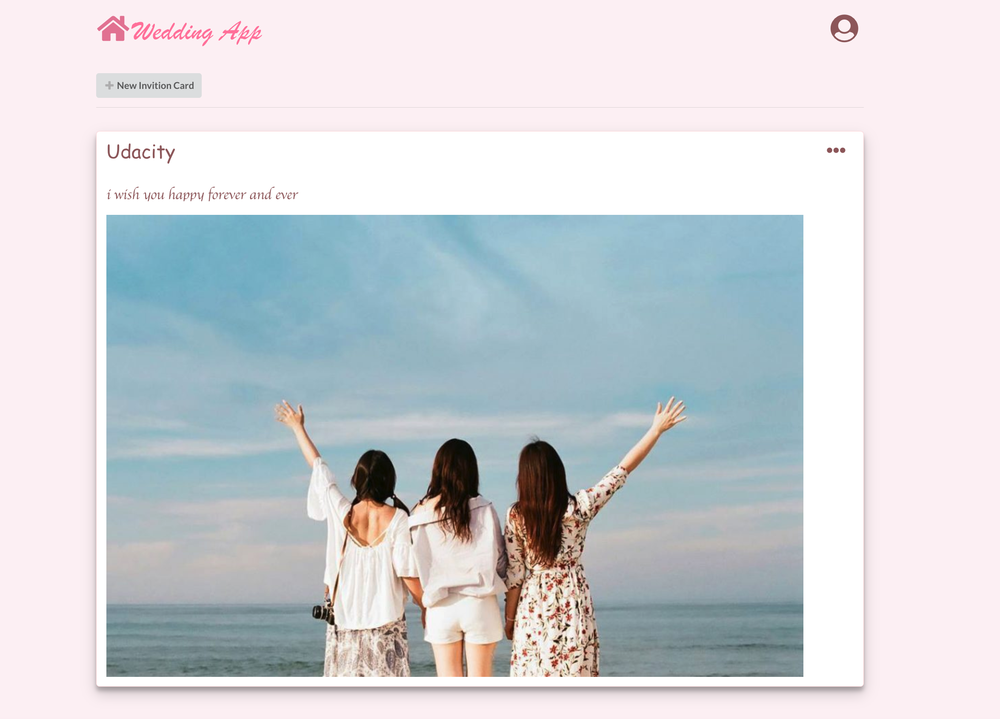

i base todo project to develop this web server

i was custom loggin screen:

After login you can see home screen

click button new invition card to make new invition card

input information to make invition card

click Create invitation QR code to make invite card

scan QR code to open invite website

can input wish and image like below

after click post button, home screen was updated

